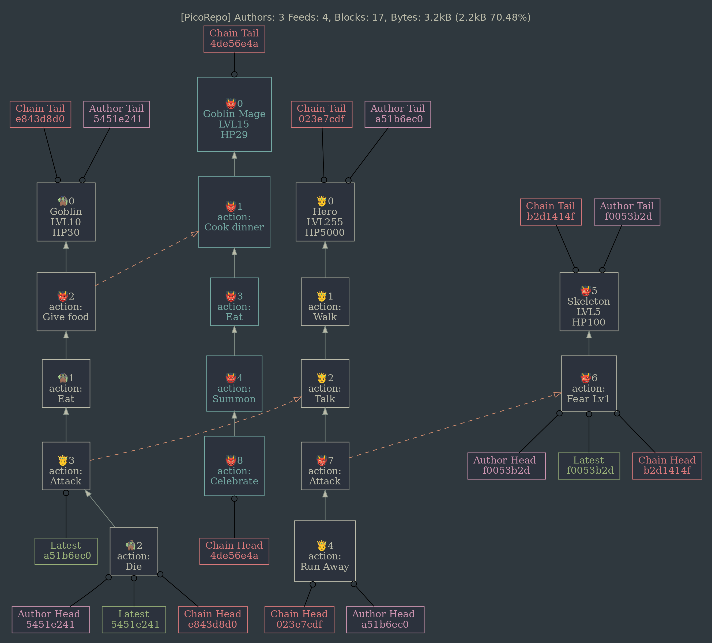

[`code style | standard`](https://standardjs.com/)
```
 _ . _ _ ._   _  _
|_)|(_(_)|(/_|_)(_)
|            |
```

> Block storage

The repo is part of [picostack](https://github.com/telamon/picostack)

This is a low-level blockstore for [picofeeds](https://github.com/telamon/picofeed/) that stores consistent chains using a fast access scheme.

- uses [abstract-leveldown](https://www.npmjs.com/package/abstract-level) for storage backends


[Discord](https://discord.gg/8RMRUPZ9RS)

## Use

```bash
$ npm install picorepo levelup memdown
```

```js
import { Repo } from 'picorepo'
import { Feed } from 'picofeed'

const db = new MemoryLevel('pico', {
  keyEncoding: 'buffer',
  valueEncoding: 'buffer'
})

const repo = new Repo(db)

// Generate an crypto identity consisting of a public and secret key
const { pk, sk } = Feed.signPair()

const feed = new PicoFeed()
feed.append('Alpha', sk)
feed.append('Beta', sk)
feed.append('Gamma', sk)

const numberAccepted = await repo.merge(feed) // => 3 blocks

// Retrieve feed by Author
const alt1 = await repo.loadHead(pk)

// Retrive feed by block-signature
const alt2 = await repo.resolveFeed(feed.first.sig)
```

## Graphviz support

To avoid brain-leakage I've added a tool that renders dot-files to
easier inspect which blocks are stored and where their tags are located.

```js
import { writeFileSync } from 'node:fs'
import { inspect } from 'picorepo/dot'

// generate graph as string
const dotString = await inspect(repo)

// dump as file
writeFileSync('repo.dot', dotString)
```

```bash
# use xdot to view it
xdot repo.dot

# or render as png
dot -Gcenter="true" -Gsize="8,8\!" -Gdpi=100 -Kdot -Tpng -O *.dot
```


## Changelog
### 2.0.0 2023-04-30
- ported to picofeed v4

### 1.3.1 2022-08-02
- added experimental mode 'allowDetached'

### 1.3.0 Eons later
- added optional graphviz/dot generator
- added index for chain-id
- added async repo.listFeeds()
- changed repo.writeBlock() to use batch ops.

### 1.0.0 first release

## Contributing

By making a pull request, you agree to release your modifications under
the license stated in the next section.

Only changesets by human contributors will be accepted.

## License

[AGPL-3.0-or-later](./LICENSE)

2021 &#x1f12f; Tony Ivanov
